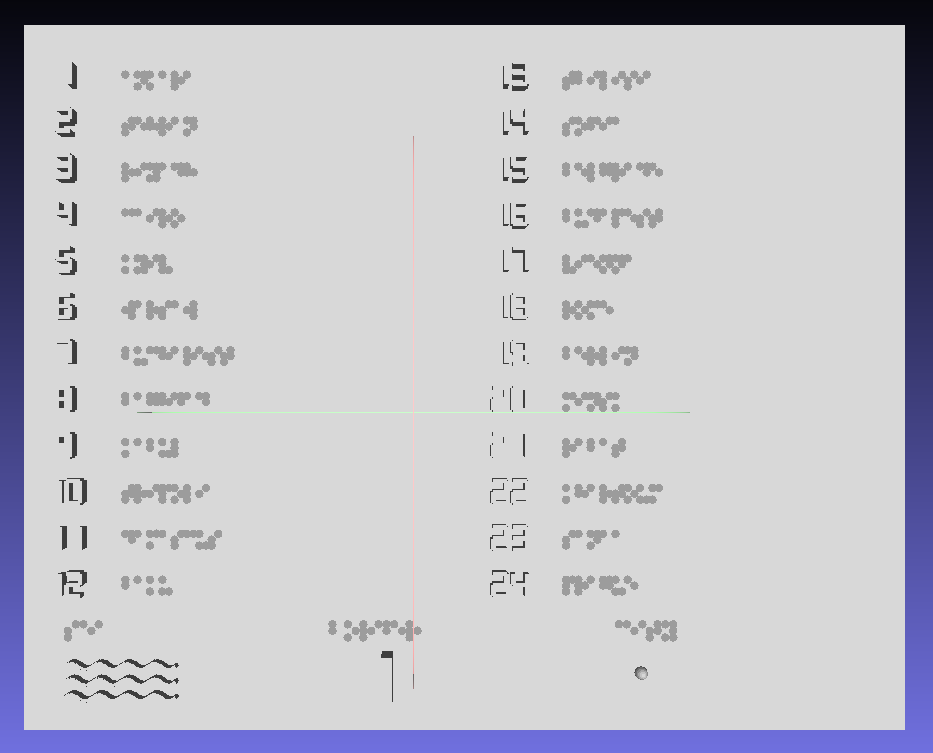

# Blind Map — Tactile Map for the Visually Impaired


A 3D-printable tactile map that helps blind people learn geography by touch.


## What is this?

This project generates STL files for 3D printing a tactile map. The map is designed so a blind person can:

- **Feel country borders** — raised walls (5mm) separate countries
- **Recognize terrain** — mountains are higher, plains are lower
- **Find capitals** — small bumps mark capital cities
- **Identify countries** — each country has a tactile number (1-24)
- **Distinguish water from land** — sea has a wave texture

The map splits into 4 puzzle pieces (200×160mm each) that snap together, plus a legend card with country names in Braille.

## Features

| What | How it feels |
|------|--------------|
| Country borders | Raised walls between countries |
| Mountains/plains | Higher = mountains, lower = plains |
| Sea | Wavy texture |
| Capitals | Small bumps |
| Country numbers | Raised 7-segment digits (like a calculator) |
| Legend | Braille text + texture samples |



## Region Covered

Europe, Middle East, North Africa, Caucasus — 24 countries total.

Coordinates: 5°—70° E, 12°—55° N

## How to Use

### 1. Get the data

```bash
# Download country borders (automatic)
python core/prepare_data/download_geojson.py
python core/prepare_data/merge_geojson.py

# Download elevation data (manual)
# Go to: https://www.ngdc.noaa.gov/mgg/global/
# Download ETOPO1_Bed_g_gmt4.grd
# Place in: data/input/
```

| Data | What for | Source |
|------|----------|--------|
| Country borders | Walls between countries | [geoBoundaries](https://www.geoboundaries.org/) |
| Elevation | Terrain (mountains, plains) | [NOAA ETOPO1](https://www.ngdc.noaa.gov/mgg/global/) |

### 2. Generate STL files

```bash
python core/generate.py
```

Output: `data/output/*.stl` — 4 map cards + 1 legend card

### 3. Print

Send STL files to a 3D printer:

| Setting | Value | Note |
|---------|-------|------|
| Material | PLA | Common, cheap, safe |
| Infill | 15-20% | How solid inside (lower = faster) |
| Layer height | 0.2mm | Print quality |

## Project Structure

```
blind_map/
├── core/
│   ├── config.py              # Map region settings
│   ├── constants.py           # Size/height parameters
│   ├── generate.py            # Main STL generator
│   └── prepare_data/          # Data download scripts
├── data/                      # Not in repo (too large)
│   ├── input/                 # Source data
│   ├── output/                # Generated STL files
│   └── countries/             # Country borders
└── README.md
```

## Technical Details

| Parameter | Value |
|-----------|-------|
| Full map size | 400×320 mm |
| Single card | 200×160 mm |
| Base thickness | 6 mm |
| Border height | 5 mm |
| Puzzle connectors | Tabs/slots in base |
