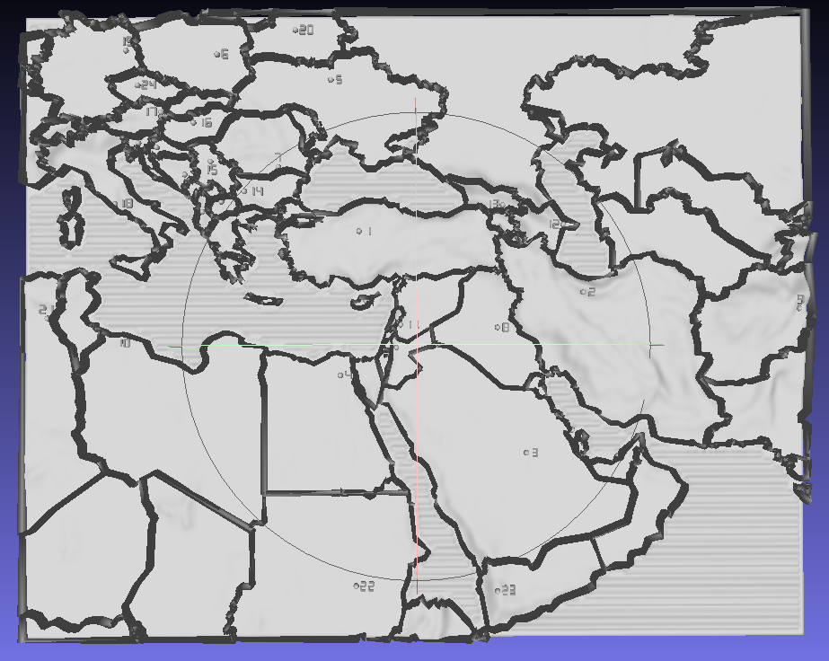

# Blind Map — Tactile Map for the Visually Impaired

3D-printable map for learning geography by touch.



## Purpose

Enable a visually impaired person to:
- Memorize country locations
- Understand how countries border each other
- Feel the terrain (mountains, plains)

## Specification

### Dimensions

| Parameter | Value |
|-----------|-------|
| Map size | 400×320 mm |
| Cards | 4 pcs (2×2) + legend |
| Card size | 200×160 mm |
| Base thickness | 6 mm |

### Region

- Bounds: 5°—70° E, 12°—55° N
- Includes: Balkans, Caucasus, Middle East, North Africa
- 24 numbered countries

### Tactile Elements

| Element | Height | Size | Note |
|---------|--------|------|------|
| **Country borders** | 5 mm | width 2.5 mm | Walls between countries |
| **Terrain** | 0—10 mm | — | Mountains, plains |
| **Water (sea)** | 2 mm | waves every 4 mm | Sinusoidal waves |
| **Capitals** | 2 mm | ⌀3 mm | Hemisphere (bump) |
| **Country numbers** | 1.5 mm | 7-segment | Near capital |

### Puzzle Connectors

| Parameter | Value |
|-----------|-------|
| Tab (protrusion) | 8×4×3 mm |
| Slot (hole) | +0.5 mm clearance |
| Position | Bottom part of base |

### Legend (separate card)

- Numbers 1-24 with country names (Braille)
- Texture samples: waves (sea), wall (border), bump (capital)

## Project Structure

```
blind_map/
├── core/
│   ├── config.py       # Map region (7 lines)
│   ├── constants.py    # Parameters (65 lines)
│   └── generate.py     # STL generator (1626 lines)
├── data/
│   ├── input/          # ETOPO1 elevation data
│   ├── output/         # STL files (output)
│   └── countries/      # GeoJSON country borders
└── README.md
```

## 3D Printing

- **Material**: PLA
- **Infill**: 15-20%
- **Layer**: 0.2 mm
